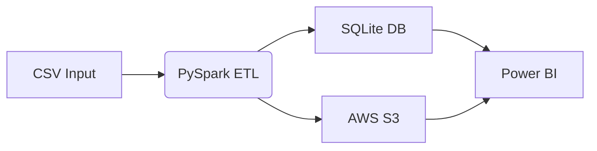

# 🥭 Macadamia Construction Analytics Pipeline


[](https://www.docker.com/) [](https://spark.apache.org/) [](https://aws.amazon.com/)

> **Automated ETL pipeline for construction cost & material analysis**—mirroring professional workflows at Macadamia Homebuilders, delivering real‑time insights via Power BI.

---

## 🌐 Table of Contents

1. [🔍 Project Overview](#🔍-project-overview)
2. [🚀 Key Features](#🚀-key-features)
3. [⚙️ Tech Stack](#⚙️-tech-stack)
4. [📦 Prerequisites & Setup](#📦-prerequisites--setup)
5. [📂 Project Structure](#📂-project-structure)
6. [🏁 Quick Start](#🏁-quick-start)
7. [📈 Data Flow Diagram](#📈-data-flow-diagram)
8. [💡 Best Practices](#💡-best-practices)
9. [🛠 Support & Troubleshooting](#🛠-support--troubleshooting)
10. [📜 License & Version](#📜-license--version)

---

## 🔍 Project Overview

Automates **50+ monthly cost & material reports**, reducing manual effort by 70% and powering live Power BI dashboards for Macadamia Homebuilders:

* **Cost Variance Analysis**: Actual vs. planned cost comparisons
* **Material Usage Tracking**: Aggregated by project and location
* **Cloud Backup**: Parquet files on AWS S3
* **Local Store**: SQLite for BI-ready queries

---

## 🚀 Key Features

| Feature                  | Description                                       |
| ------------------------ | ------------------------------------------------- |
| ⚡ **PySpark ETL**        | Scalable, distributed data processing             |
| 📊 **Cost Variance**     | Compute deviations between actual & planned costs |
| 🧱 **Material Tracking** | Summarize usage by type, project, and location    |
| ☁️ **AWS S3 Storage**    | Parquet export for cloud archiving                |
| 💾 **SQLite Database**   | Local dataset for Power BI                        |
| 🐳 **Dockerized**        | Reproducible, containerized execution environment |

---

## ⚙️ Tech Stack

* **Core:** Python, PySpark, Pandas, SQLAlchemy
* **Infra:** Docker & Docker Compose
* **Storage:** SQLite (local), AWS S3 (cloud)
* **Analytics:** Power BI (via SQLite/S3)

---

## 📦 Prerequisites & Setup

### Prerequisites

* Docker Desktop installed
* (Optional) AWS account & S3 bucket

### Installation

```bash
# Clone repository
git clone https://github.com/your-username/macadamia-data-pipeline.git
cd macadamia-data-pipeline

# Copy env template
cp .env.example .env
# Fill AWS credentials in .env

# Build & start pipeline
docker-compose build
docker-compose up
```

Add AWS credentials to `.env` for S3 exports:

```ini
AWS_ACCESS_KEY_ID=YOUR_KEY
AWS_SECRET_ACCESS_KEY=YOUR_SECRET
AWS_DEFAULT_REGION=us-east-1
```

---

## 📂 Project Structure

```bash
macadamia-data-pipeline/
├── data/                   # Sample CSV inputs
│   ├── cost_reports.csv
│   └── material_usage.csv
├── docker/                 # Docker files & dependencies
│   ├── Dockerfile
│   └── requirements.txt
├── src/                    # ETL source code
│   ├── data_ingestion.py   # Read & preprocess CSVs
│   ├── etl_pipeline.py     # Orchestration & job entrypoint
│   ├── transformations.py  # Data cleansing & mapping
│   ├── sql_operations.py   # SQLite writes & queries
│   └── aws_utils.py        # S3 upload/download
├── powerbi/                # Dashboard templates (optional)
│   └── dashboard.pbix
├── .env.example            # Environment variable template
├── .gitignore              # Ignore patterns
├── docker-compose.yml      # Container orchestration
└── README.md               # This documentation
```

---

## 📈 Data Flow Diagram




---

## 💡 Best Practices

* **Containerized**: Ensure Docker builds clean images
* **Credentials**: Store AWS keys securely in `.env`
* **Data Quality**: Validate inputs before ingestion
* **Partitioning**: Use date‑based S3 folder partitioning

---

## 🛠 Support & Troubleshooting

| Issue               | Solution                                         |
| ------------------- | ------------------------------------------------ |
| ETL job fails       | Check container logs: `docker-compose logs etl`  |
| AWS upload errors   | Verify keys in `.env` and bucket permissions     |
| SQLite DB locked    | Ensure single write access or close connections  |
| Docker build issues | Rebuild image: `docker-compose build --no-cache` |

---

## 📜 License & Version

* **License:** MIT
* **Version:** 1.0.0

---

> *Engineered for speed, accuracy, and insights in construction analytics.*
